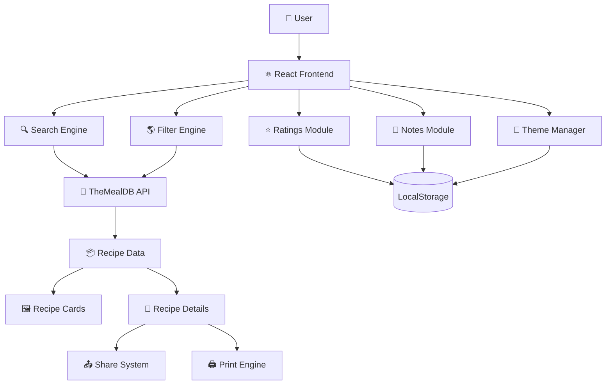
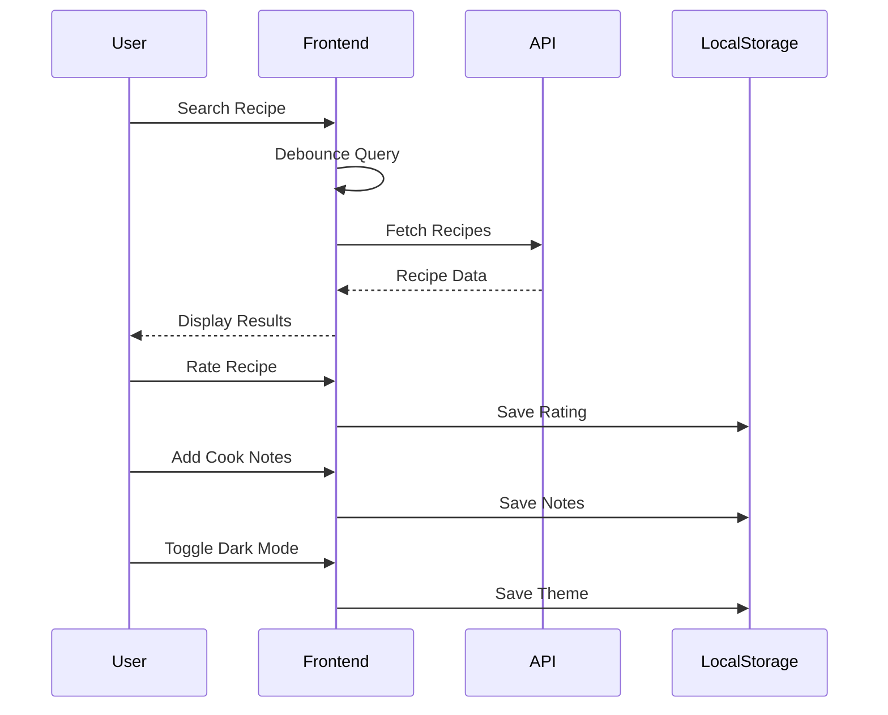

<div align="center">

# 🍽️ Recipe Finder

### Discover • Explore • Cook • Share


<br/>
<br/>


</div>

---

# ✨ Overview

**Recipe Finder** is a modern and visually rich recipe discovery web application built using **React + Vite**.  
It allows users to search and explore recipes from around the world with intelligent filtering, dark mode, ratings, personal cook notes, live search, sharing, and print-ready recipe pages.

Designed with a premium UI/UX approach, the application delivers a smooth and immersive cooking experience for food lovers.

---

# 🚀 Live Features

## 🔍 Smart Recipe Search
- Debounced live search
- Instant results fetching
- Responsive search experience

## 🌎 Multi Filters
- Filter by:
  - Category
  - Cuisine / Area
  - Search Query

## 🌙 Dark Mode
- Beautiful warm dark theme
- System preference detection
- Persistent theme storage

## ⭐ Ratings System
- Save local star ratings
- Interactive recipe feedback

## 📝 Cook Notes
- Personal notes per recipe
- Auto-save with debounce

## 📄 Print-Friendly Recipes
- Optimized recipe printing
- Clean paper layout

## 📤 Share Recipes
- Native Web Share API
- Clipboard fallback support

## 🕘 Recent Searches
- Stores latest successful searches
- Quick-access search chips

## 📚 Pagination + Sorting
- A–Z sorting
- Z–A sorting
- Paginated browsing

---

# 🧠 System Architecture



---

# 🏗️ Tech Stack

| Technology | Purpose |
|---|---|
| React 19 | Frontend UI |
| Vite | Fast Build Tool |
| React Router | Routing |
| CSS3 | Styling |
| TheMealDB API | Recipe Data |
| LocalStorage | Persistence |
| React Icons | UI Icons |

---

# 📂 Project Structure

```bash
Recipe-Finder/
│
├── public/
│
├── src/
│   ├── components/
│   │   ├── AreaFilter.jsx
│   │   ├── Navbar.jsx
│   │   ├── RecipeCard.jsx
│   │   ├── RecentSearches.jsx
│   │   └── StarRating.jsx
│   │
│   ├── hooks/
│   │   ├── useDebounce.js
│   │   └── useDarkMode.js
│   │
│   ├── pages/
│   │   ├── Home.jsx
│   │   └── RecipeDetails.jsx
│   │
│   ├── styles/
│   │   └── global.css
│   │
│   ├── App.jsx
│   └── main.jsx
│
├── package.json
└── README.md
```

---

# ⚡ Application Workflow



---

# 🎨 UI Highlights

## 🌟 Premium User Experience
- Smooth transitions
- Interactive cards
- Warm modern color palette
- Fully responsive design

## 🌙 Dark Theme
- Elegant amber-inspired dark mode
- Comfortable viewing experience

## 📱 Responsive Design
- Mobile optimized
- Tablet friendly
- Desktop enhanced

---

# 📦 Local Storage Architecture

```javascript
localStorage['recentSearches']
localStorage['mealRatings']
localStorage['theme']
localStorage['cookNotes:{mealId}']
localStorage['recipeFavorites']
```

---

# 🛠️ Installation

## Clone Repository

```bash
git clone https://github.com/LoganthP/Recipe-Finder.git
```

## Navigate into Project

```bash
cd Recipe-Finder
```

## Install Dependencies

```bash
npm install
```

## Start Development Server

```bash
npm run dev
```

---

# 🌐 API Used

## 🍲 TheMealDB API

Used for:
- Recipe Search
- Category Filters
- Cuisine Filters
- Recipe Details

---

# 🔥 Advanced Features

| Feature | Status |
|---|---|
| Debounced Search | ✅ |
| Dark Mode | ✅ |
| Area Filters | ✅ |
| Star Ratings | ✅ |
| Notes Auto Save | ✅ |
| Pagination | ✅ |
| Share API | ✅ |
| Print Support | ✅ |
| Recent Searches | ✅ |

---

# 🎯 Future Improvements

- 🔐 User Authentication
- ☁️ Cloud Sync
- 🤖 AI Recipe Recommendations
- 🛒 Grocery List Generator
- ❤️ Social Sharing
- 🎙️ Voice Search
- 📊 Nutrition Tracking

---

# 🤝 Contributing

Contributions are welcome!

```bash
Fork → Clone → Create Branch → Commit → Push → Pull Request
```

---

# 📜 License

This project is licensed under the MIT License.
